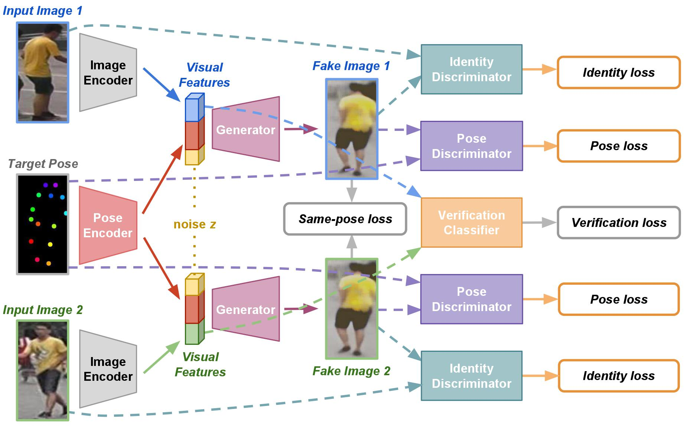

 
# FD-GAN: Pose-guided Feature Distilling GAN for Robust Person Re-identification

<p align="center"></p>

[[Paper]](https://arxiv.org/abs/1810.02936)

[Yixiao Ge](mailto:yxge@link.cuhk.edu.hk)\*, [Zhuowan Li](mailto:zli110@jhu.edu)\*, [Haiyu Zhao](mailto:zhaohaiyu@sensetime.com), [Guojun Yin](mailto:gjyin@mail.ustc.edu.cn), [Shuai Yi](mailto:yishuai@sensetime.com), [Xiaogang Wang](mailto:xgwang@ee.cuhk.edu.hk), and [Hongsheng Li](mailto:hsli@ee.cuhk.edu.hk)  
Neural Information Processing Systems (**NIPS**), 2018 (* equal contribution)

Pytorch implementation for our NIPS 2018 work. With the proposed siamese structure, we are able to learn **identity-related** and **pose-unrelated** representations.

## Prerequisites
- Python 3
- [Pytorch](https://pytorch.org/) (We run the code under version 0.3.1, maybe lower versions also work.)

## Getting Started

### Installation
- Install dependencies (e.g., [visdom](https://github.com/facebookresearch/visdom) and [dominate](https://github.com/Knio/dominate)). You can install all the dependencies by:
```
pip install scipy, pillow, torchvision, sklearn, h5py, dominate, visdom
```
- Clone this repo:
```
git clone https://github.com/yxgeee/FD-GAN
cd FD-GAN/
```

### Datasets
We conduct experiments on [Market1501](http://www.liangzheng.org/Project/project_reid.html), [DukeMTMC](https://github.com/layumi/DukeMTMC-reID_evaluation), [CUHK03](http://www.ee.cuhk.edu.hk/~xgwang/CUHK_identification.html) datasets. We need pose landmarks for each dataset during training, so we generate the pose files by [Realtime Multi-Person Pose Estimation](https://github.com/tensorboy/pytorch_Realtime_Multi-Person_Pose_Estimation). And the raw datasets have been preprocessed by the code in [open-reid](https://github.com/Cysu/open-reid). 
Download the prepared datasets following below steps:
- Create directories for datasets:
```
mkdir datasets
cd datasets/
```
- Download these datasets through the links below, and `unzip` them in the same root path.  
*Market1501*: [[Google Drive]](https://drive.google.com/open?id=1LS5_bMqv-37F14FVuziK63gz0wPyb0Hh), [[Baidu Pan]](https://pan.baidu.com/s/13C7zcELYzd-5EnjAeDcX9A)  
*DukeMTMC*: [[Google Drive]](https://drive.google.com/open?id=1Ujtm-Cq7lpyslBkG-rSBjkP1KVntrgSL), [[Baidu Pan]](https://pan.baidu.com/s/1B52P9RzTXv0JLmfmiA3aKg)  
*CUHK03*: [[Google Drive]](https://drive.google.com/open?id=1R7oCwyMHYIxpRVsYm7-2REmFopP9TSXL), [[Baidu Pan]](https://pan.baidu.com/s/1zH2jcEa_igC7Lzgts4FwVQ)  

## Usage
As mentioned in the original [paper](https://arxiv.org/abs/1810.02936), there are three stages for training our proposed framework.

### Stage I: reID baseline pretraining
We use a Siamese baseline structure based on `ResNet-50`. You can train the model with follow commands,
```
python baseline.py -b 256 -j 4 -d market1501 -a resnet50 --combine-trainval \
					--lr 0.01 --epochs 100 --step-size 40 --eval-step 5 \
					--logs-dir /path/to/save/checkpoints/
```
You can train it on specified GPUs by setting `CUDA_VISIBLE_DEVICES`, and change the dataset name `[market1501|dukemtmc|cuhk03]` after `-d` to train models on different datasets.  
Or you can download the pretrained baseline model directly following the link below,
- [Market1501_baseline_model](https://drive.google.com/open?id=1oNLf-gazgfN0EqkdIOKtcJSBx22BuO1-)
- [DukeMTMC_baseline_model](https://drive.google.com/open?id=1iVXIaXT6WQzKuLD3eDcBZB-3aNeZ6Ivf)
- [CUHK03_baseline_model](https://drive.google.com/open?id=1jubhvKl_Ny9b89wbX0-u2GhPEeXMLaUQ)

<a name="stageI"></a>And **test** them with follow commands,
```
python baseline.py -b 256 -d market1501 -a resnet50 --evaluate --resume /path/of/model_best.pth.tar
```

### Stage II: FD-GAN pretraining
We need to pretain FD-GAN with the image encoder part (*E* in the original paper and *net_E* in the code) fixed first. You can train the model with follow commands,
```
python train.py --display-port 6006 --display-id 1 \
	--stage 1 -d market1501 --name /directory/name/of/saving/checkpoints/ \
	--pose-aug gauss -b 256 -j 4 --niter 50 --niter-decay 50 --lr 0.001 --save-step 10 \
	--lambda-recon 100.0 --lambda-veri 0.0 --lambda-sp 10.0 --smooth-label \
	--netE-pretrain /path/of/model_best.pth.tar
```
You can train it on specified GPUs by setting `CUDA_VISIBLE_DEVICES`. For main arguments,
- `--display-port`: display port of [visdom](https://github.com/facebookresearch/visdom), e.g., you can visualize the results by `localhost:6006`.
- `--display-id`: set `0` to disable [visdom](https://github.com/facebookresearch/visdom).
- `--stage`: set `1` for Stage II, and set `2` for stage III.
- `--pose-aug`: choose from `[no|erase|gauss]` to make augmentations on pose maps.
- `--smooth-label`: smooth the label of GANloss or not. 

Other arguments can be viewed in [options.py](https://github.com/yxgeee/FD-GAN/blob/master/fdgan/options.py).
Also you can directly download the models for stage II,
- [Market1501_stageII_model](https://drive.google.com/open?id=1kIBuPzz-Ig70dE3rU-5-kyo3nGJP01NS)
- [DukeMTMC_stageII_model](https://drive.google.com/open?id=1dD1cbg2jo5qhPbkMbsRYACRcVMrm28-o)
- [CUHK03_stageII_model](https://drive.google.com/open?id=1552oDot-vgA27b-mCspJAuzaOl685koz)

There are four models in each directory for separate nets.

### Stage III: Global finetuning
Finetune the whole framework by optimizing all parts. You can train the model with follow commands,
```
python train.py --display-port 6006 --display-id 1 \
	--stage 2 -d market1501 --name /directory/name/of/saving/checkpoints/ \
	--pose-aug gauss -b 256 -j 4 --niter 25 --niter-decay 25 --lr 0.0001 --save-step 10 --eval-step 5 \
	--lambda-recon 100.0 --lambda-veri 10.0 --lambda-sp 10.0 --smooth-label \
	--netE-pretrain /path/of/100_net_E.pth --netG-pretrain /path/of/100_net_G.pth \
	--netDi-pretrain /path/of/100_net_Di.pth --netDp-pretrain /path/of/100_net_Dp.pth
```
You can train it on specified GPUs by setting `CUDA_VISIBLE_DEVICES`.  
We trained this model on a setting of batchsize 256. If you don't have such or better hardware, you may decrease the batchsize (the performance may also drop).
Or you can directly download our final model,
- [Market1501_stageIII_model](https://drive.google.com/open?id=1w8xqopW0icA3VIxZyelI9k-Fb8rRCME7)
- [DukeMTMC_stageIII_model](https://drive.google.com/open?id=1axBHUcI7JmPbw8Y_mSpMKWIY9FUfFKMI)
- [CUHK03_stageIII_model](https://drive.google.com/open?id=1q6HkDlDUIV9YNUwAggy-HI9zYQjt7Ihk)

And **test** `best_net_E.pth` by the same way as mentioned in [Stage I](#stageI).

## TODO
- scripts for generate pose landmarks.
- generate specified images.

## Citation
Please cite our paper if you find the code useful for your research.
```
@inproceedings{ge2018fdgan,
  title={FD-GAN: Pose-guided Feature Distilling GAN for Robust Person Re-identification},
  author={Ge, Yixiao and Li, Zhuowan and Zhao, Haiyu and Yin, Guojun and Wang, Xiaogang and Li, Hongsheng},
  booktitle={Advances in Neural Information Processing Systems},
  year={2018}
}
```

## Acknowledgements
Our code is inspired by [pytorch-CycleGAN-and-pix2pix](https://github.com/junyanz/pytorch-CycleGAN-and-pix2pix) and [open-reid](https://github.com/Cysu/open-reid).
